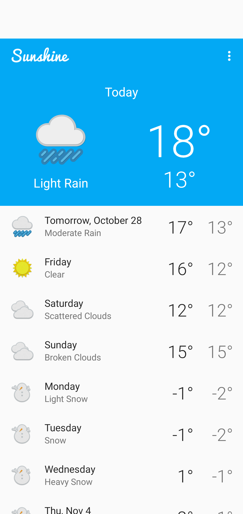
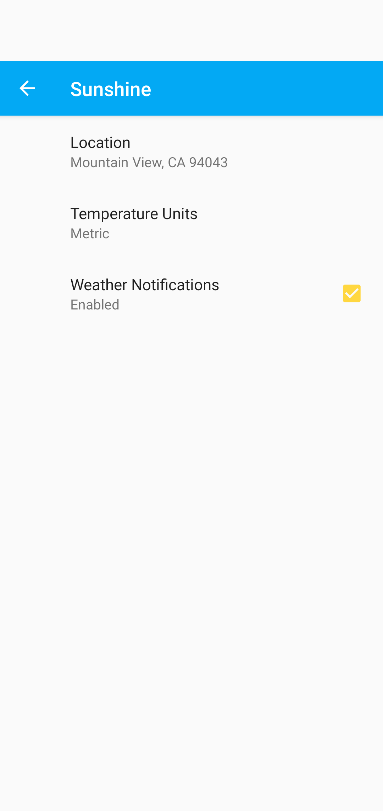
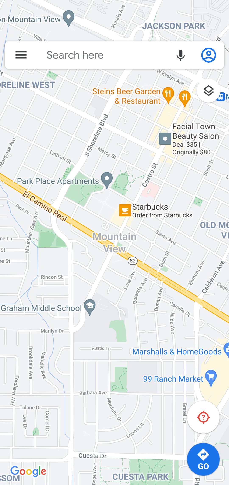
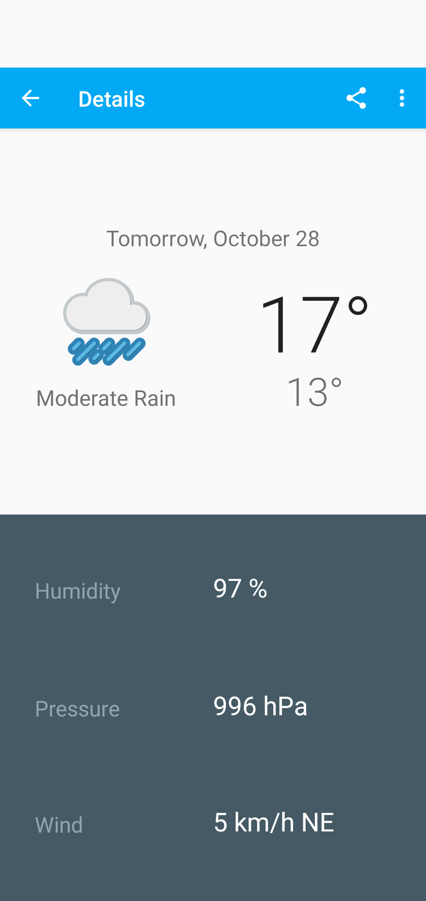

# Sunshine-App
This is the weather app that I built during the "Developing Android Apps" course by Udacity.
## :heavy_check_mark: Overview
* The app allows you to see weather forecasts for your local area and receive notifications about tomorrow's weather.
* I made the app available in English and Russian languages. 
* In settings, you also can set your preferences like location and temperature units as well as enable/disable notifications.
* The map location is included in order to show the user his/her location on Google maps. 

## 	:camera: Screenshots
Main Screen | Settings | Location on Maps | Details
---| --- | --- | ---
 |  |  | 

